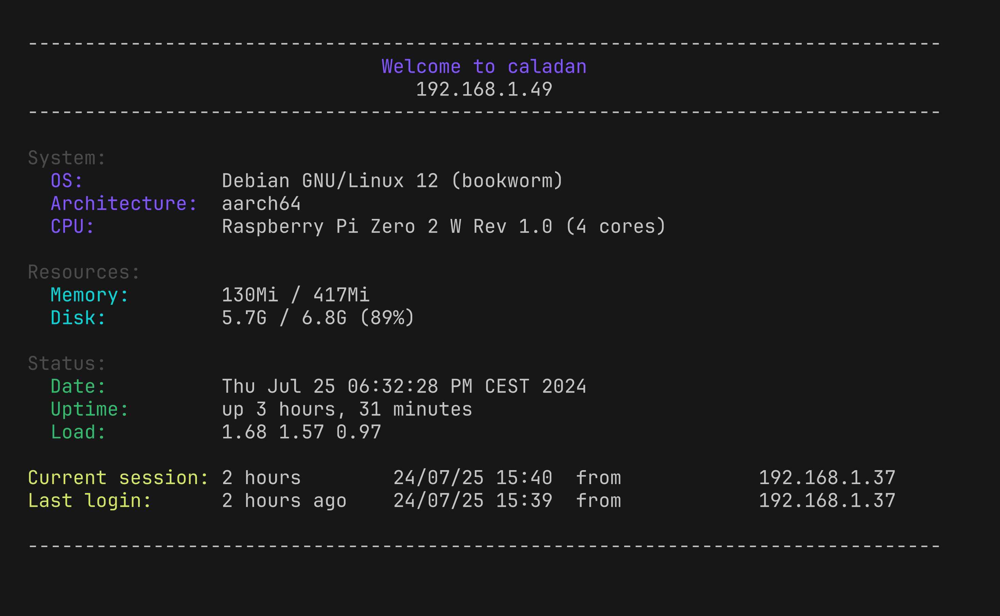

# Custom MOTD Setup

## Overview

This setup customizes the [MOTD (Message Of The Day)](https://en.wikipedia.org/wiki/Message_of_the_day) displayed when logging into a server via SSH. The script provides system information in a neatly formatted way.

## Functionality

### `setup_custom_motd` function inside the bootstrapping setup:

1. **Script Location**: The custom MOTD script is located at `$HOME/.config/motd/custom_motd.sh`.
2. **Backup**: Backs up existing configurations to `$HOME/.local/share/motd_backups`.
3. **SSH Config Update**: Modifies `/etc/ssh/sshd_config` to disable `PrintLastLog`.
4. **Remove Default MOTD**: Backs up and removes the default `/etc/update-motd.d/10-uname` script.
5. **Create Wrapper**: Creates or updates the MOTD wrapper script at `/etc/update-motd.d/99-custom-motd` to call the custom script.
6. **PAM Configuration**: Checks and verifies PAM configurations to ensure they point to the correct MOTD file.
7. **Restart SSH**: Restarts the SSH service if any changes were made.

This process ensures that every SSH login displays the custom MOTD with updated system information.

